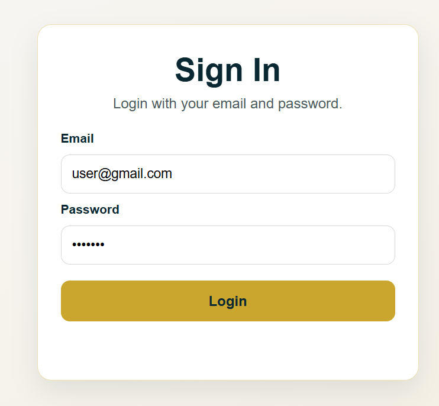
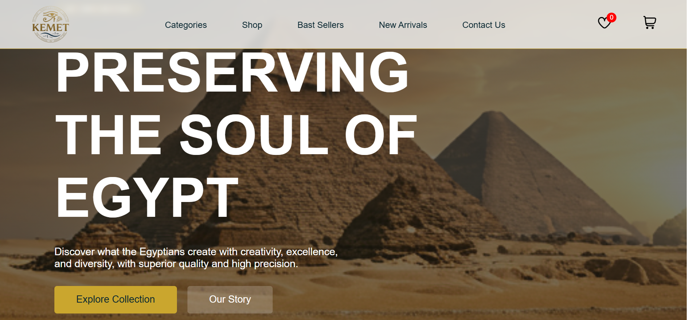
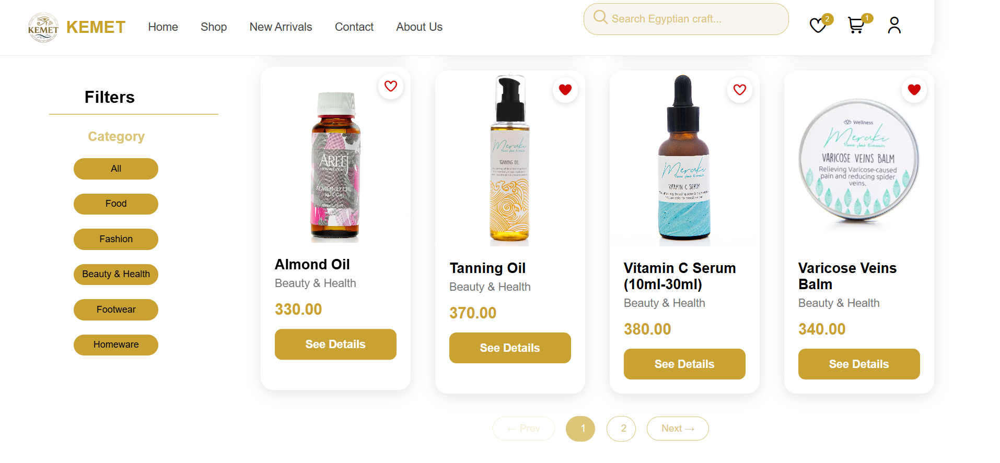
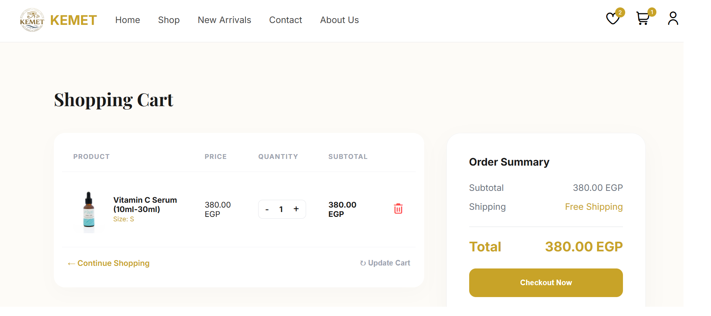
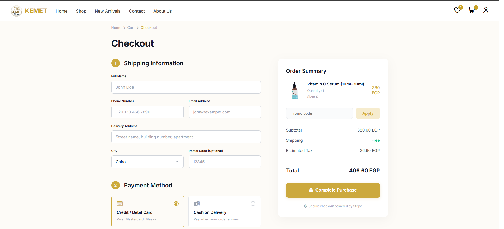
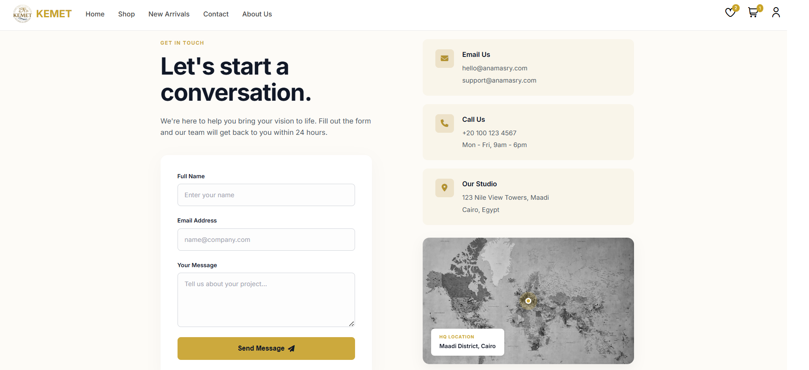

# 🏺 Kemet

A fully client-side multi-page e-commerce web application built with **HTML, CSS, and JavaScript** — no frameworks, no dependencies. Features a complete shopping experience from product browsing to checkout.

---

## 📸 Screenshots
 ### 🔐 Login

> Clean sign-in card with email and password fields and a gold Login button.
 
### 🏠 Home Page

> Hero banner with the iconic pyramids, "Explore Collection" and "Our Story" CTAs, and a top navbar with Categories, Shop, Best Sellers, New Arrivals, and Contact Us.
 
### 🛍️ Shop / Product Catalog

> Browse all products with a sidebar category filter (Food, Fashion, Beauty & Health, Footwear, Homeware) and a real-time search bar. Products are paginated across multiple pages.
 
### 🛒 Shopping Cart

> Full cart view with product image, price, quantity controls (+/-), subtotal, order summary panel, free shipping indicator, and an Update Cart option.
 
### 💳 Checkout

> Two-step checkout with shipping information (name, phone, email, address, city) and payment method selection (Credit/Debit Card or Cash on Delivery), plus a live order summary with promo code input.
 
### 📞 Contact

> Contact form with email, phone, studio address (Maadi District, Cairo), and an embedded map pinpointing the HQ location.
 
---


## ✨ Features

- 🏠 **Home Page** — Hero banner, featured products, and navigation
- 🛒 **Shopping Cart** — Add, remove, and update product quantities
- 💳 **Checkout Flow** — Form-based checkout with order summary
- ✅ **Order Success** — Confirmation screen after placing an order
- 📦 **Order History** — View past orders per user
- ❤️ **Wishlist** — Save products for later
- 🗂️ **Product Catalog** — Browse all products with category-based filtering and real-time search by product name
- 🔍 **Product Details** — Full product view with description and actions
- 🆕 **New Arrivals** — Dedicated section for latest products
- 🔐 **Login** — User authentication flow
- 📞 **Contact** — Contact form page
- ℹ️ **About Us** — Store information page
- 📦 **JSON Data** — Products and users managed via local JSON files

---
## 📁 Project Structure

```
Client-Side-Project/
│
├── ASSESTs/                  # Images, icons, and static media
│
├── CSSs/                     # Page-specific stylesheets
│   ├── home-page.css
│   ├── navbar.css
│   ├── product.css
│   ├── product_details.css
│   ├── product-navbar.css
│   ├── Cart.css
│   ├── checkout.css
│   ├── Orders.css
│   ├── whishlistPage.css
│   ├── newArrivals.css
│   ├── login.css
│   ├── contact.css
│   └── AboutUs.css
│
├── HTMLs/                    # All HTML pages
│   ├── components/           # Reusable HTML components (navbar, footer, etc.)
│   ├── index.html
│   ├── Product.html
│   ├── product_details.html
│   ├── newArrivals.html
│   ├── Cart.html
│   ├── Checkout.html
│   ├── orderSuccess.html
│   ├── Orders.html
│   ├── whishlistPage.html
│   ├── Login.html
│   ├── AboutUs.html
│   └── contact.html
│
├── SCRIPTs/                  # JavaScript logic per page
│   ├── home-page.js
│   ├── navbar.js
│   ├── product.js
│   ├── product_details.js
│   ├── product-navbar.js
│   ├── Cart.js
│   ├── checkout.js
│   ├── orders.js
│   ├── whishlist.js
│   ├── whishlistPage.js
│   ├── newArrival.js
│   ├── login.js
│   └── contact.js
│
├── all_products.json         # Product data store
├── users.json                # User data store
└── README.md
```


## 🚀 Getting Started

### Prerequisites

No build tools or package managers required. Just a browser!

### Run Locally

1. **Clone the repository:**
   ```bash
   git clone https://github.com/rwidagaber/Client-Side-Project.git
   ```

2. **Open the project:**
   Navigate to the `HTMLs/` folder and open `index.html` in your browser.

   > 💡 **Tip:** For best results (especially JSON fetching), use a local server like [Live Server](https://marketplace.visualstudio.com/items?itemName=ritwickdey.LiveServer) in VS Code instead of opening files directly.

3. **Using VS Code Live Server:**
   - Install the Live Server extension
   - Right-click `index.html` → **Open with Live Server**

---

## 🛠️ Tech Stack

| Technology | Usage |
|------------|-------|
| HTML5 | Page structure and markup |
| CSS3 | Styling and responsive layout |
| JavaScript  | Dynamic behavior and DOM manipulation |
| JSON | Local data for products and users |

---

## 📦 Data

- **`all_products.json`** — Contains all product records (name, price, image, category, etc.)
- **`users.json`** — Stores user account data for login simulation

Data is fetched and manipulated entirely on the client side using `fetch()` and `localStorage`.

---

## 🤝 Contributing

Contributions are welcome! Feel free to open an issue or submit a pull request.

1. Fork the repo
2. Create your feature branch: `git checkout -b feature/your-feature`
3. Commit your changes: `git commit -m 'Add some feature'`
4. Push to the branch: `git push origin feature/your-feature`
5. Open a Pull Request

---


>Kemet — Built with ❤️ using pure HTML, CSS & JavaScript — no frameworks needed.
